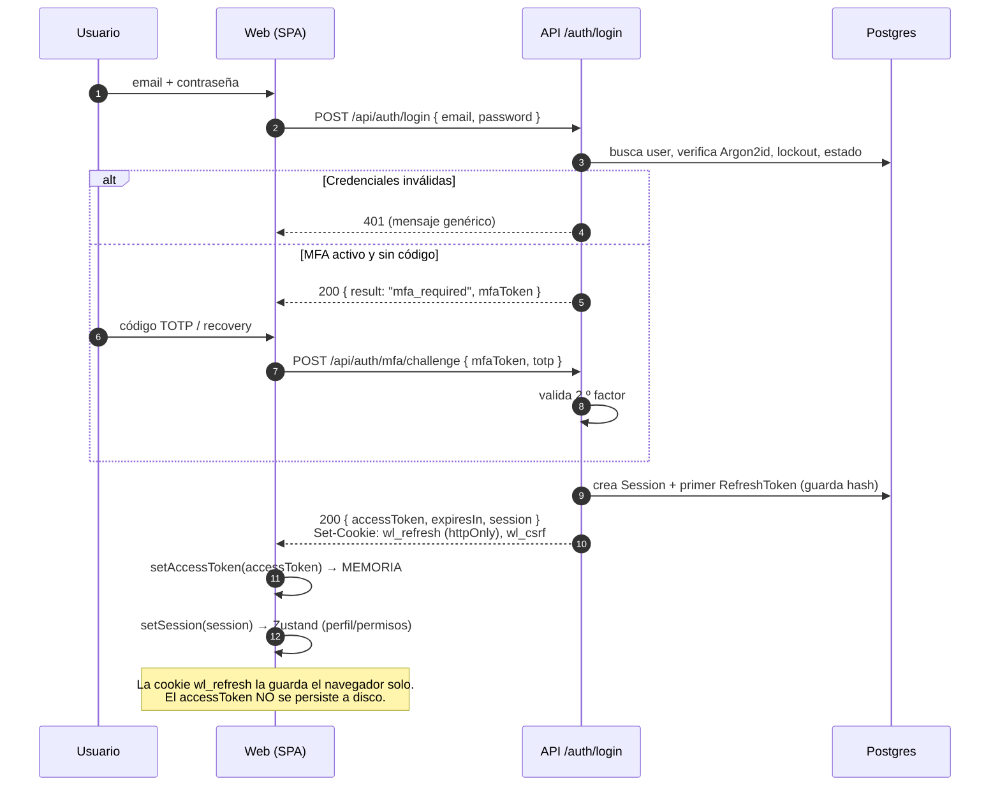
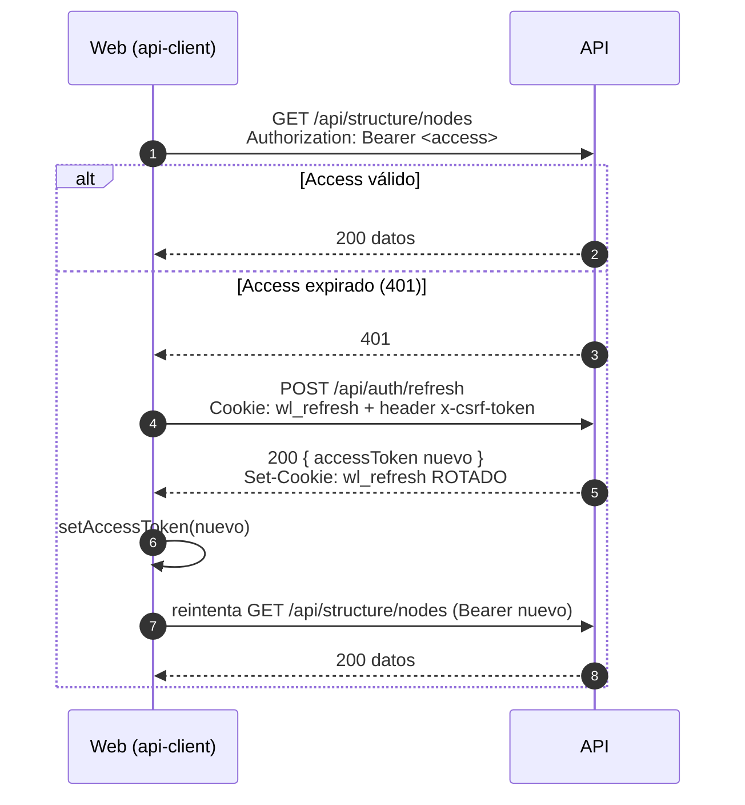
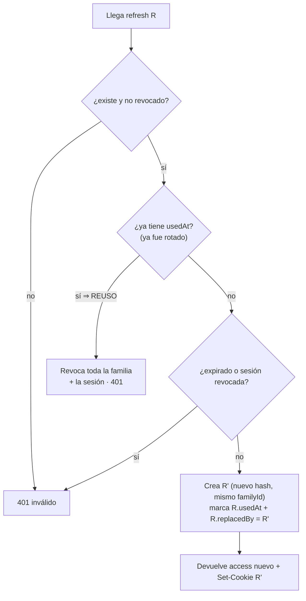
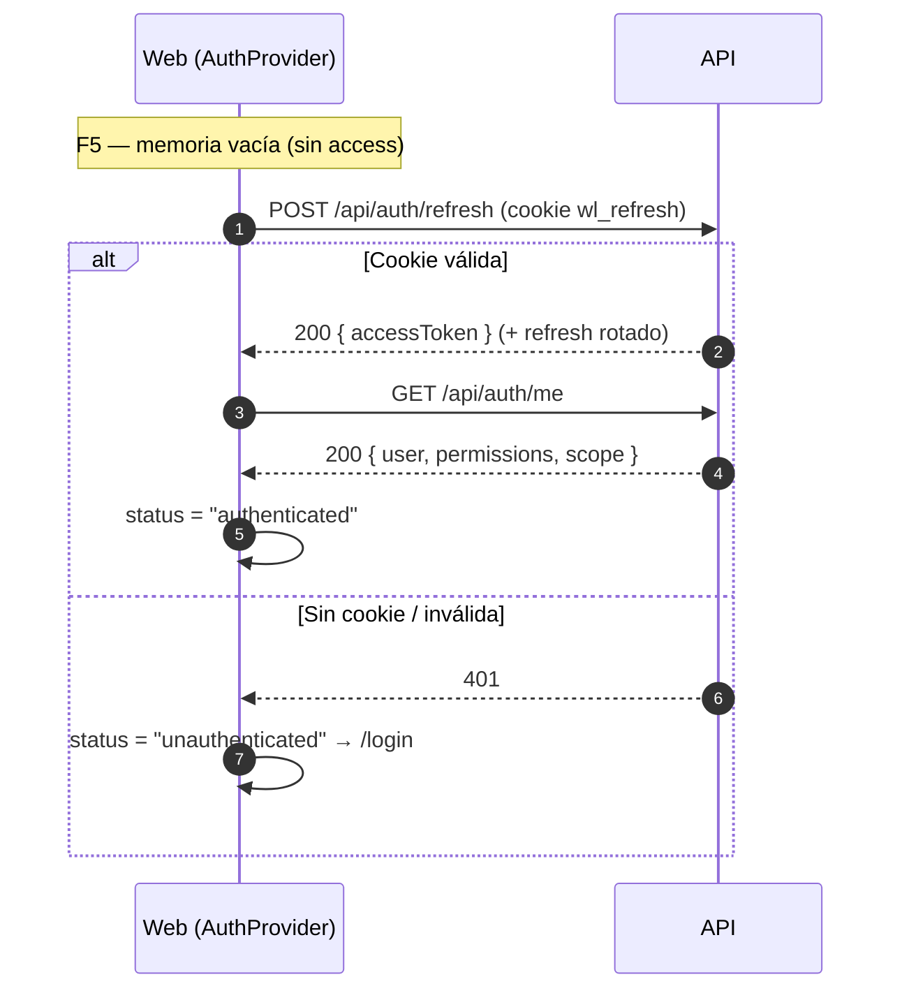
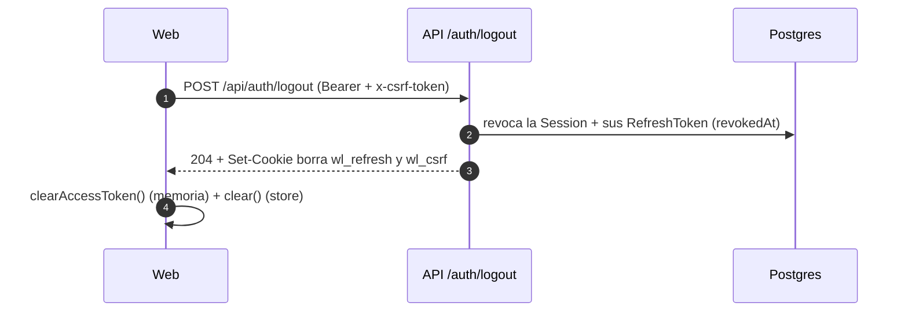

# Flujo de autenticación y tokens — Lyra WatchLog

> Documento de referencia del **modelo de sesión**: qué tokens existen, **dónde se
> guardan**, cómo se emiten/rotan/revocan y por qué. Fiel al código de Fase 1.
> Última actualización: 2026-06-06.

Si vienes con la duda *"hice login y no vi nada en el Network / en el storage"*,
salta a la sección **[8. "No vi pasar nada": dónde mirar en DevTools](#8-no-vi-pasar-nada-dónde-mirar-en-devtools)**.

---

## 1. Resumen en una frase

Usamos el patrón estándar de la industria: un **access token JWT de vida corta**
que viaja en el header `Authorization: Bearer` y **vive solo en memoria** del
navegador, más un **refresh token opaco de vida larga** que viaja en una **cookie
`httpOnly`** y del que en la base de datos **solo se guarda su hash**. El refresh
**rota en cada uso** y detecta reutilización (señal de robo).

---

## 2. Los dos tokens de un vistazo

| | **Access token** | **Refresh token** |
|---|---|---|
| Formato | JWT firmado (HS256) | Cadena opaca aleatoria (32 bytes, base64url) |
| Contenido | `sub` (userId), `email`, `sid` (sessionId), `exp` | Nada legible: es un secreto aleatorio |
| Vida (`.env`) | **15 min** (`JWT_ACCESS_TTL=900`) | **30 días** (`JWT_REFRESH_TTL=2592000`) |
| Dónde se guarda en el navegador | **Memoria JS** (variable en `session-token.ts`) | **Cookie `httpOnly`** `wl_refresh` |
| ¿JS puede leerlo? | Sí (la app lo pone en el header) | **No** (`httpOnly`) |
| ¿Va en cada request? | Sí, como `Authorization: Bearer …` | Solo a `/api/auth/*` (cookie con `path` acotado) |
| Cómo viaja del backend | En el **cuerpo JSON** de la respuesta | En cabecera **`Set-Cookie`** |
| Qué guarda el backend | Nada (es *stateless*, se valida con la firma) | Solo el **hash SHA-256** en la tabla `RefreshToken` |
| Se renueva | Vía `/auth/refresh` | **Rota** en cada `/auth/refresh` (uno nuevo por uso) |

Hay además una tercera pieza, **no es un token de identidad**: la cookie **CSRF**
`wl_csrf` (no `httpOnly`), explicada en la [sección 7](#7-csrf-doble-envío).

---

## 3. Mapa de almacenamiento (¿dónde vive cada cosa?)

```
┌──────────────────────────── NAVEGADOR ────────────────────────────┐
│                                                                    │
│   Memoria JS (se borra al recargar la pestaña)                     │
│   ┌──────────────────────────────────────────┐                    │
│   │ session-token.ts                          │                    │
│   │   accessToken  = "eyJhbGciOi…"  (JWT)     │  ← NO en          │
│   │   expiresAt    = 1717..        (epoch ms) │    localStorage    │
│   └──────────────────────────────────────────┘                    │
│   ┌──────────────────────────────────────────┐                    │
│   │ auth-store.ts (Zustand)                   │                    │
│   │   session = { user, permissions, scope }  │  ← perfil para UI │
│   │   (NO el token)                           │    (no secretos)   │
│   └──────────────────────────────────────────┘                    │
│                                                                    │
│   Cookies (las gestiona el navegador, no el JS de la app)          │
│   ┌──────────────────────────────────────────┐                    │
│   │ wl_refresh  httpOnly  SameSite=Strict     │  ← refresh token  │
│   │             path=/api/auth                │    (oculto a JS)   │
│   │ wl_csrf     legible   SameSite=Strict     │  ← token CSRF     │
│   │             path=/                        │                    │
│   └──────────────────────────────────────────┘                    │
│                                                                    │
│   localStorage:  (solo "wl_remember_email" si marcaste recordar)   │
│                  NUNCA un token.                                    │
└────────────────────────────────────────────────────────────────────┘

┌──────────────────────────── BACKEND (Postgres) ───────────────────┐
│  Session       { id, userId, expiresAt, revokedAt, ip, ua }        │
│  RefreshToken  { tokenHash(SHA-256), familyId, usedAt, revokedAt,  │
│                  replacedById, expiresAt }   ← solo el HASH         │
└────────────────────────────────────────────────────────────────────┘
```

**Por qué así (modelo de amenazas):**
- **Access en memoria, no en `localStorage`** → si hubiera un XSS, no puede robar un
  token persistente: al recargar, la memoria se vacía.
- **Refresh en cookie `httpOnly`** → el JavaScript de la página **no puede leerlo**,
  así que un XSS tampoco lo extrae.
- **En la BD solo el hash del refresh** → si se filtrara la base, los refresh no son
  reutilizables (no se puede revertir el SHA-256).
- **`SameSite=Strict` + CSRF de doble envío** → defensa en profundidad contra CSRF.

---

## 4. Login (paso a paso, con bifurcación MFA)



Respuesta real del login exitoso (cuerpo JSON):

```jsonc
{
  "result": "authenticated",
  "accessToken": "eyJhbGciOiJIUzI1Ni...",   // -> va a memoria JS
  "expiresIn": 900,                          // segundos (15 min)
  "session": { "user": { … }, "permissions": [ … ], "scope": { … } }
}
```

Y en las cabeceras de esa misma respuesta:

```
Set-Cookie: wl_refresh=<opaco>; HttpOnly; SameSite=Strict; Path=/api/auth; Max-Age=2592000
Set-Cookie: wl_csrf=<aleatorio>; SameSite=Strict; Path=/; Max-Age=2592000
```

---

## 5. Petición autenticada y **refresh transparente** ante un 401

Cada llamada a la API añade el access token en memoria. Si expiró (401), el cliente
hace **un** refresh y reintenta, todo invisible para el usuario. Código en
`lib/api-client.ts`.



> Detalle: los refresh concurrentes se **coalescen** en una sola petición
> (`inFlightRefresh`), para que diez 401 simultáneos no disparen diez refresh.

---

## 6. Rotación del refresh y **detección de reutilización**

El refresh es de **un solo uso**: cada `/auth/refresh` emite uno nuevo y marca el
anterior como usado (`usedAt`). Todos los de una misma sesión comparten un
`familyId`. Si llega **otra vez** un refresh ya rotado ⇒ es un indicio de robo ⇒
se **revoca toda la familia** y la sesión. Código en `token.service.ts`.



```
Familia (una sesión):   R1 ──rota──▶ R2 ──rota──▶ R3 (vigente)
                         used         used         activo
Si alguien reusa R1  ▶  REUSO detectado ▶ se revocan R1,R2,R3 + Session
```

---

## 7. Refresh **proactivo** (no esperamos al 401)

Mientras hay sesión, `AuthProvider` programa un refresh **~30 s antes** de que el
access expire, así casi nunca se ve un 401. Línea de tiempo de un access de 15 min:

```
0min ─────────────────────────────────── 14:30 ─── 15:00
│ login: access en memoria                  │         │
│                                            │         └─ expiraría
│                                            └─ refresh PROACTIVO (lead 30s)
│                                               nuevo access + refresh rotado
└───────────────────────────────────────────────────────────────────▶ tiempo
```

(`REFRESH_LEAD_MS = 30_000` en `AuthProvider.tsx`.)

---

## 8. Bootstrap al recargar la página

Como el access vive **solo en memoria**, al recargar (F5) se pierde. No importa:
al arrancar, la app intenta un **refresh silencioso** con la cookie `wl_refresh` y,
si funciona, rehidrata la sesión cargando `/auth/me`. Por eso **sigues logueado**
tras recargar aunque el access no se guarde en disco.



---

## 9. CSRF (doble envío)

Las cookies viajan **solas** en cada request al mismo origen; por eso los endpoints
que confían en la cookie (`/auth/refresh` y `/auth/logout`) exigen además un header
`x-csrf-token` **igual** a la cookie `wl_csrf`. Un sitio atacante puede provocar que
el navegador **envíe** la cookie, pero **no puede leerla** para copiarla al header
(SameSite + same-origin) ⇒ la petición falla. El resto de endpoints usan `Bearer`
(no dependen de cookie, así que no son vulnerables a CSRF). Código en `csrf.guard.ts`.

```
Cliente legitimo:   Cookie: wl_csrf=ABC   +   Header x-csrf-token: ABC   -> coinciden  -> 200
Ataque CSRF:        Cookie: wl_csrf=ABC   +   (no puede leer ABC)        -> falta/!=    -> 403
```

---

## 10. Logout



> Nota: el access token JWT es *stateless* (no se "borra" en el servidor); como dura
> 15 min y la sesión queda revocada, deja de poder refrescarse. Para corte inmediato
> de **todas** las sesiones (p. ej. al **restablecer la contraseña**) existe
> `TokenService.revokeAllForUser`, que revoca todo de golpe. Ver `SECURITY.md` §6.

---

## 11. Dónde mirar en DevTools (responde "no vi nada")

Al hacer login **sí** ocurre tráfico; lo que pasa es que el token no se guarda donde
sueles mirar. Para verlo:

1. **Network** → filtra por `Fetch/XHR` → verás `POST /api/auth/login` (Vite lo
   proxya, aparece como **same-origin** `/api/...`). 
   - En **Response** está el `accessToken` (en el JSON).
   - En **Response Headers** está `Set-Cookie: wl_refresh …` (puede aparecer
     atenuado o marcado como restringido por ser `httpOnly`).
2. **Application → Cookies → tu origen**: ahí están `wl_refresh` (verás la marca
   **HttpOnly ✓**, por eso JS no la lee) y `wl_csrf`.
3. **Application → Local Storage / Session Storage**: **vacío de tokens** a propósito.
   Solo podrías ver `wl_remember_email` si marcaste "recordar correo".
4. Al **recargar** la página verás un `POST /api/auth/refresh` automático (el
   bootstrap de la sección 8), y antes de los 15 min, otro refresh **proactivo**.
5. En cualquier llamada a la API (`/api/auth/me`, `/api/structure/...`) mira
   **Request Headers**: `Authorization: Bearer eyJ…` (ese es el access en memoria).

> Resumen: **no hay token en el storage** porque el diseño lo evita. El access está
> en una variable JS (se ve en el header `Authorization`) y el refresh está en una
> cookie `httpOnly` (se ve en *Cookies*, no en *Storage*, y JS no lo lee).

---

## 12. ¿Se cierra la sesión al cerrar la pestaña o el navegador?

**No.** Que el access token viva "en memoria" **no** significa que pierdas la sesión
al cerrar la pestaña. Hay dos piezas con persistencia distinta:

- **Access token** → memoria JS. Al cerrar la pestaña **se pierde** (deseable: nada
  sensible queda en disco).
- **Refresh token** → cookie `wl_refresh` emitida con **`Max-Age` = 30 días**, es decir
  una cookie **persistente** que **sobrevive** a cerrar la pestaña y el navegador.

Al reabrir la app, el bootstrap (sección 8) hace un `/auth/refresh` silencioso con esa
cookie y restaura la sesión **sin pedir credenciales**.

```
Cierras pestaña ─▶ access (memoria) se borra
                   refresh (cookie wl_refresh, 30 días) PERSISTE
Reabres app     ─▶ /auth/refresh con la cookie ─▶ access nuevo ─▶ sesión restaurada
```

**Sí hay que volver a iniciar sesión si:** pasaron >30 días sin uso (caduca la cookie),
hiciste **logout**, se **revocaron las sesiones** (p. ej. tras un reset de contraseña o
por detección de reuso del refresh), o el navegador está en incógnito / configurado para
**borrar cookies al cerrar**.

> En resumen: la *persistencia* de la sesión la da el **refresh en cookie** (larga vida),
> no el access en memoria (corta vida). Lo mejor de ambos: resistencia a XSS **y**
> comodidad de no re-loguear en cada visita.

## 13. Mapa de archivos

| Pieza | Archivo |
|---|---|
| Custodia del access en memoria | `apps/watchlog-web/src/lib/session-token.ts` |
| Cliente HTTP (Bearer, 401→refresh, CSRF) | `apps/watchlog-web/src/lib/api-client.ts` |
| Ciclo de vida (bootstrap + refresh proactivo) | `apps/watchlog-web/src/auth/AuthProvider.tsx` |
| Estado de sesión para la UI | `apps/watchlog-web/src/auth/auth-store.ts` |
| Orquestación de login/MFA/cambio | `apps/watchlog-api/src/auth/auth.service.ts` |
| Emisión/rotación/revocación de tokens | `apps/watchlog-api/src/auth/token.service.ts` |
| Cookies (refresh httpOnly + CSRF) | `apps/watchlog-api/src/auth/auth.cookies.ts` |
| Validación del access (Bearer) | `apps/watchlog-api/src/authz/jwt-access.guard.ts` |
| Guard CSRF de doble envío | `apps/watchlog-api/src/auth/csrf.guard.ts` |
| Esquema de datos (Session/RefreshToken) | `apps/watchlog-api/prisma/schema.prisma` |

Ver también: `SECURITY.md` (políticas y endurecimiento), `DECISIONS.md` (por qué de
cada decisión), `DATA_MODEL.md` (entidades).
